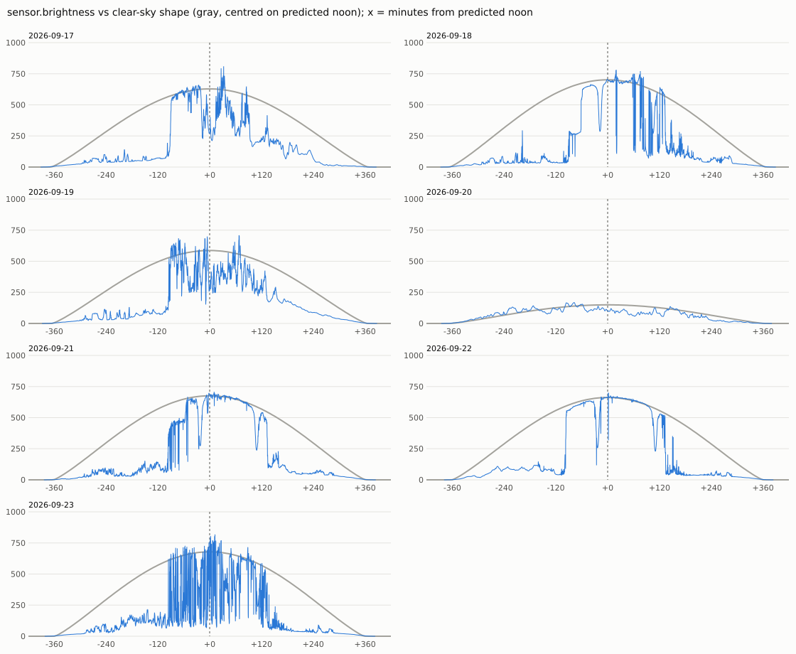
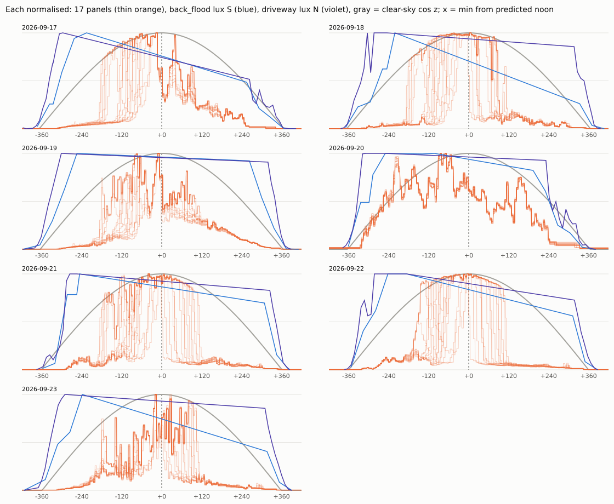

# How it works

## The setup

The machine this runs on already has a chronyd disciplining the system clock from PTP, and that clock is good to well under a microsecond. sundial-ntp does not touch it. It runs a second chronyd with `-x`, which tells chronyd to leave the system clock alone and just track its own offset and frequency relative to it. That second chronyd serves NTP on its own address. Whatever offset it's told about, it adds to the system clock when it answers a query.

So the whole job is to produce one number a day: how far the sun's idea of the time is from the system clock's. Everything below is about producing that number honestly.

## Attempt one: find solar noon

The obvious approach is to watch a light sensor, find when the light peaks, compare that with when the sun should be highest (the NOAA equations in `solar.py` give that to well under a second), and set the clock accordingly.

The weather station here has an irradiance sensor. Here's what a week of it looks like against a clear-sky curve:



The sensor only sees direct sun from roughly 95 minutes before solar noon to 125 minutes after. The rest of the day it sits in shade. Fitting a curve to that finds the middle of the gap between the trees, not noon. On the days that fit at all, the answers were 8 to 30 minutes off.

## What the panels show

The roof has 17 panels with per-panel monitoring, one inverter each. Their output, each scaled to its own maximum, over the same week:



Every panel has its own window of direct sun, and the windows are staggered: panels light up at different times between about −210 and −60 minutes, and go dark between about −30 and +110. The edges are sharp and look the same from one clear day to the next. That's the useful part. A shade edge happens when the sun reaches a particular position behind a particular obstacle. Seventeen panels give around 34 such events on a clear day, plus two on the weather sensor. Each one is a timing mark.

(The two lux sensors in that chart top out at 900 lux, so they spend the whole day saturated and are no use for anything here.)

## Turning power into "lit fraction"

Clouds are the first problem. A passing cloud and a shade edge both make a panel's output drop. The trick is that clouds dim every panel at once and shade doesn't. So each panel's power is divided by the second-brightest panel's power at the same moment. The panels are all polled together by the gateway, every 5 minutes. A lit panel comes out around 1 and a shaded one around 0.1, whatever the sky is doing. The second-brightest rather than the brightest keeps one odd panel from setting the scale.

That ratio only means something while some panel is actually getting direct sun. The code keeps a sample only if the brightest panel is producing at least 75% of what it normally does at that time of day, and at least 60 W.

The weather sensor gets divided by a clear-sky model instead (Haurwitz). There's no second sensor to compare against, so it's judged a whole day at a time: a day counts for the sensor only if at least 70% of its usual sunny window really was sunny.

Every channel ends up as a profile of lit fraction against hour angle, meaning minutes from solar noon, on a one-minute grid from −480 to +480. The June solstice needs about ±454.

## The model

A shade edge's time depends on where the sun is, and at a given hour angle that depends only on the solar declination, which moves slowly through the year. So to predict today's profile for a channel, the code takes the learned daily profiles and, minute by minute, fits a weighted straight line through them against declination, then reads it off at today's declination. Days closer in declination get more weight (Gaussian, σ = 1.5°).

## Finding today's offset

With a predicted profile for each channel, the code slides today's observations back and forth against it, from −20 to +20 minutes, and scores each shift. Only minutes where the prediction is changing count, because the flat lit and shaded stretches carry no timing information. Each minute's squared error is capped, so the odd bad minute can't dominate. The best shift is then refined between grid points with a parabola.

This is done separately for the panels as a group and for the sensor. A group's answer is thrown out if:

- it had too few edge minutes to work with (400 for the panels), or
- the best shift doesn't stand out clearly from shifts five or more minutes away ("sharpness" below 1.8), or
- the fit is much worse than usual (more than 2.5× the median in back-testing).

Those rules came straight out of the data. Every bad day during testing was a mostly overcast one where the fit had a handful of edges and a flat, ambiguous minimum.

If both groups pass, they're averaged, weighted by how accurate each has been in back-testing. If they disagree wildly, the panels win. If a panel never lights up where it should (snow, a dead inverter), it's dropped for the day. If all the panels are out, the sensor carries on alone.

An earlier version timed each edge on its own, at the moment the lit fraction crossed 0.5. That got about 85 s RMS. Fitting whole profiles got it to about 33 s, because the soft, tree-shaped edges carry more information than a single threshold crossing.

## Learning, serving, and whether this is cheating

The model is learned from past data timed by the system clock. That's the one place in the whole system where a clock other than the sun is consulted, and it's worth being straight about what it means.

A sundial has to be set up once. You mark its hours by comparing its shadow with a trusted clock, and after that it tells time on its own. `solar-noon learn` is the marking step. It records where each panel's shade edges fell, in system-clock time, over the last 60 days. `solar-noon apply` is the telling step. It uses only that frozen model and today's sunlight.

Learning can't be done once and forgotten, though. The model only knows sun positions it has seen, and the sun's path changes by up to 0.4° of declination a day around the equinoxes. So it gets re-learned weekly, and `apply` refuses to run if today is more than 4° of declination from anything in the model.

The honest summary: over weeks, the offset is pinned to the system clock by re-learning. Day to day, the number comes from the sun. The back-test numbers in the README are for models one and two weeks old, which is the situation the server is actually in.

The same back-test also sets the thresholds and the accuracy weights. It pretends each day's model is a week old by withholding the preceding week, so the gates are tuned for a model as stale as it gets between re-learns.

## Getting the answer into chrony

The first version used chrony's manual mode: `chronyc manual on`, then `settime` with the sun's idea of the time. That works, but manual mode always reports its reference as 127.127.1.1. You can't give it a name.

Refclocks can have a name. So now `solar-noon apply` just writes the day's offset to a small SQLite log, and `solar-noon feed` runs all the time, posting "the sun says it is now T" to chronyd once a second. It uses the NTP shared-memory protocol, the same `shmTime` segment and mode-1 update dance gpsd uses. chronyd is configured with

```
refclock SHM 7:perm=0660 refid SUN poll 4
local stratum 10
```

and clients see stratum 1, reference ID `SUN`.

When a new fix moves the offset by tens of seconds, chrony logs "Jitter of SUN exceeds maxjitter" for a few seconds, then takes the new value. Frequency stays at zero, because between fixes the sun is (by construction) running at exactly the system clock's rate.

If there's been no accepted fix for 14 days, the feed stops. chronyd then coasts on its last offset. It eventually falls back to `local stratum 10` once its error estimate grows past a second, which takes days at chrony's default 1 ppm drift assumption. Before the very first fix, it serves plain system time at stratum 10.

## What it doesn't do

- **Leaf fall moves the shade.** Trees drop their leaves, so edges will shift through October and November. Weekly re-learning follows slow changes, but expect worse numbers while the trees are changing fastest.
- **The history is short.** Per-panel data starts 2026-08-21, so everything above rests on about five weeks of panels and nine of the sensor. A year from now the model will have seen every season once.
- **The snow fallback is barely tested.** Only a handful of days so far have been clear across the sensor's whole sunny window.
- **The accuracy isn't claimed to the server's clients.** chrony reports the refclock's usual tiny dispersion, not ±45 s. Anyone who points a real NTP client at this should know what they're getting.
